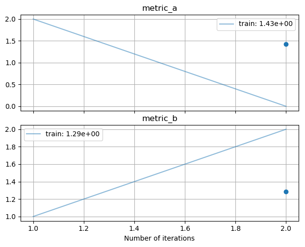

########################
Logging Data with Noggin
########################

Noggin's core role in an experiment is to log your measurements and store them in an organized, accessible manner. :class:`~noggin.logger.LiveLogger` is responsible for facilitating this. This class is meant to serve as
a drop-in replacement for :class:`~noggin.plotter.LivePlot`, and is useful for running experiments where you do
not need a live visualization of your data.

Batch-level measurements can be logged for both train and test splits of data, and an epoch can be marked in order to compute the mean-value of each metric over that epoch.

Let's record measurements for two batches of data and mark an epoch. Note that we need to provide the logger
the measurements by name, via a `dictionary <https://www.pythonlikeyoumeanit.com/Module2_EssentialsOfPython/DataStructures_II_Dictionaries.html>`_.

.. code-block:: pycon

    >>> from noggin import LiveLogger
    >>> logger = LiveLogger()
    >>> logger.set_train_batch(dict(metric_a=2., metric_b=1.), batch_size=10)
    >>> logger.set_train_batch(dict(metric_a=0., metric_b=2.), batch_size=4)
    >>> logger.set_train_epoch()  # compute the mean statistics
    >>> logger
    LiveLogger(metric_a, metric_b)
    number of training batches set: 2
    number of training epochs set: 1
    number of testing batches set: 0
    number of testing epochs set: 0

:ref:`Accessing our logged batch-level and epoch-level data <accessing-data>` works the same way as when working with an instance of :class:`~noggin.plotter.LivePlot`:

.. code-block:: pycon

    # accessing the logged data as xarrays.
    >>> batch_array, epoch_array = logger.to_xarray("train")
    >>> batch_array
    <xarray.Dataset>
    Dimensions:     (iterations: 2)
    Coordinates:
      * iterations  (iterations) int32 1 2
    Data variables:
        metric_a    (iterations) float64 2.0 0.0
        metric_b    (iterations) float64 1.0 2.0
    >>> epoch_array
    <xarray.Dataset>
    Dimensions:     (iterations: 1)
    Coordinates:
      * iterations  (iterations) int32 2
    Data variables:
        metric_a    (iterations) float64 1.429
        metric_b    (iterations) float64 1.286)

Note that the epoch-level measurements are aligned with the batch-level measurements along the 'iterations' coordinate-axis. (E.g. we can see that our first epoch was recorded at batch-iteration 2).

Additionally, :ref:`saving and loading your logger <io>` is as simple as converting your logger to a dictionary, and pickling it:

.. code:: python

    import pickle

    # converting `logger` to a dictionary and pickling it
    with open('logger.pkl', 'wb') as f:
        pickle.dump(logger.to_dict(), f, protocol=-1)

    # loading the logger
    with open('logger.pkl', 'rb') as f:
        loaded_dict = pickle.load(f)
        loaded_logger = LiveLogger.from_dict(loaded_dict)

Converting a Logger to a Plotter
--------------------------------
It is easy to visualize your logged data and to convert your logger to an instance of :class:`~noggin.plotter.LivePlot`, thanks to :func:`~noggin.utils.plot_logger`:

.. code:: python

    from noggin import plot_logger
    plotter, fig, ax = plot_logger(logger)
    plotter.show()

This gives us access to the matplotlib figure and axes objects for our plot, and ``plotter`` is the instance of :class:`~noggin.plotter.LivePlot` that stores our logged data. ``plotter.max_fraction_spent_plotting`` will be 0 by default, but you can increase this value and proceed to use ``plotter`` to visualize your measurements in realtime.
