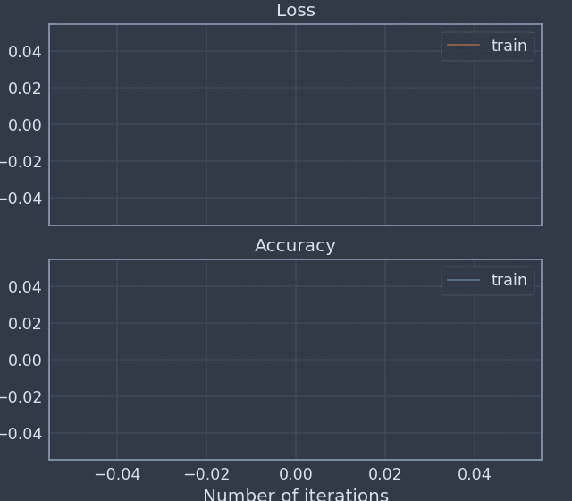

.. Noggin documentation master file, created by
   sphinx-quickstart on Thu May 30 11:24:42 2019.
   You can adapt this file completely to your liking, but it should at least
   contain the root `toctree` directive.

Noggin
======

Noggin is a simple Python tool for 'live' logging and plotting measurements during experiments. Although Noggin can be used in a general context, it is designed around the train/test and batch/epoch paradigm for training a machine learning model.

Noggin's primary features are its abilities to:

- Log batch-level and epoch-level measurements by name
- Seamlessly update a 'live' plot of your measurements, embedded within a `Jupyter notebook <https://www.pythonlikeyoumeanit.com/Module1_GettingStartedWithPython/Jupyter_Notebooks.html>`_
- Organize your measurements into a data set of arrays with labeled axes, via `xarray <http://xarray.pydata.org/en/stable/index.html>`_
- Save and load your measurements & live-plot session: resume your experiment later without a hitch

A Simple Example of Using Your Noggin
-------------------------------------
Here is a sneak peak of what it looks like to use Noggin to
record and plot data during an experiment.

.. code:: python

    %matplotlib notebook
    import numpy as np
    from noggin import create_plot, save_metrics
    metrics = ["accuracy", "loss"]
    plotter, fig, ax = create_plot(metrics)

    for i, x in enumerate(np.linspace(0, 10, 100)):
        # record and plot batch-level metrics
        x += np.random.rand(1)*5
        batch_metrics = {"accuracy": x**2, "loss": 1/x**.5}
        plotter.set_train_batch(batch_metrics, batch_size=1, plot=True)

        # record training epoch
        if i%10 == 0 and i > 0:
            plotter.plot_train_epoch()

           # cue test-evaluation of model
           for x in np.linspace(0, 10, 5):
               x += (np.random.rand(1) - 0.5)*5
               test_metrics = {"accuracy": x**2}
               plotter.set_test_batch(test_metrics, batch_size=1)
    plotter.plot()  # ensures final data gets plotted

.. toctree::
   :maxdepth: 2
   :caption: Contents:

   install
   workflow
   documentation
   changes

Indices and tables
==================

* :ref:`genindex`
* :ref:`modindex`
* :ref:`search`
