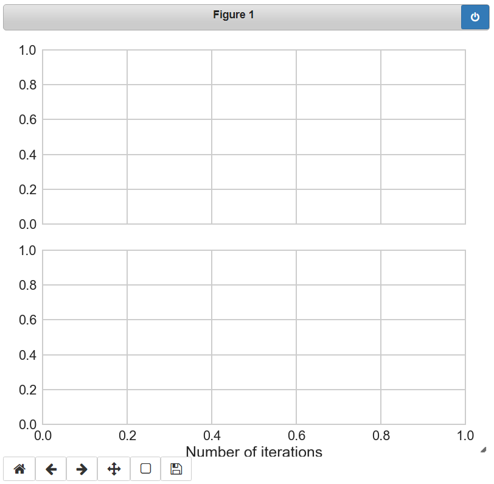
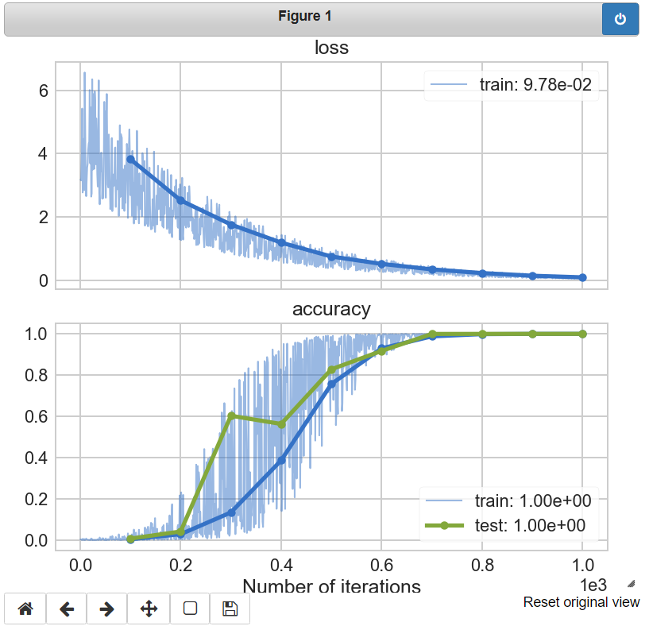

###############################
A Typical Workflow Using Noggin
###############################

Here, we will create a simple mock-up of an experiment in which we use Noggin to record and plot
our measurements. We will exercise the critical features that this library provides us with. The following demo is intended to be conducted in a `Jupyter notebook <https://www.pythonlikeyoumeanit.com/Module1_GettingStartedWithPython/Jupyter_Notebooks.html>`_.

Please note that, if you don't need to visualize your data as you collect it, you can use :class:`~noggin.logger.LiveLogger` to record your measurements in a nearly-identical manner.

Recording and Plotting Data During an Experiment
################################################
To begin, let's make up some functions to represent a data loader and a model that we are training:

.. code:: python

    """
    Defining mock data-loader and model-training functions for this simple demo.
    The details here are not important, other than the fact that
    `training_loop` returns a tuple of two floats.
    """
    from time import sleep
    from typing import Tuple

    import numpy as np
    np.random.seed(0)

    def batch_loader(num_batches):
        """Simulates loading batches of data of varying sizes"""
        for i in np.linspace(-10, 10, num_batches):
            batch_size = np.random.randint(1, 10)
            yield batch_size * [i]

    def training_loop(batch) -> Tuple[float, float]:
        """Simulates data processing Takes ~10ms to process a batch.
        Returns a 'loss' and 'accuracy'"""
        sleep(0.01)
        x = np.mean(batch)
        x += np.random.rand(1)*5 # add some noise
        return np.exp(-x / 5), 1 / (1 + np.exp(-x))

Noggin's operation is centered around metrics: the various measurements that we want to record and
visualize. Here, we will be interested in measuring the *accuracy* of our model - on both training data and validation data - along with the training *loss*. In general, we can work with any variety and number of metrics in Noggin; a metric boils down to being any scalar value.

Let's create a live-plot for these two metrics; the resulting empty plot pane will automatically update as we proceed to make measurements during our experiment. In order to permit live-plotting in a Jupyter notebook, we need to enable the appropriate plotting backend: this is done by invoking the 'cell-magic' ``%matplotlib notebook`` (Note: one typically has to run this command twice before it will take effect - this seems to be a minor bug in Jupyter).

.. code:: python

    %matplotlib notebook
    from noggin import create_plot

    metrics = ['loss', 'accuracy']
    plotter, fig, axes = create_plot(metrics)

There are two sets of axes in this figure, one for each of the metrics that we passed to :func:`~noggin.utils.create_plot`. Regarding the objects that this returned:

- ``plotter`` is an instance of :class:`~noggin.plotter.LivePlot`; it will be responsible for logging and plotting our measurements.
- ``fig`` and ``axes`` are the standard matplotlib figure and axes objects that are produced when one invokes ``matplotlib.pyplot.subplots``; these can be used to affect and save the plot as you would with any matplotlib plot.

Without further ado, let's run our mock-experiment.

We will be passing batches of training data to our model-training function, recording the training-loss (i.e. the training objective) and the accuracy of our model. An 'epoch' will represent one hundred training batches. Here we will plot the average model accuracy for that epoch. We will also, at each epoch, measure the accuracy of our model on a set of test data. This is the standard affair for training a machine learning model.

.. code:: python

    # logging and plotting measurements during an experiment
    for nbatch, batch in enumerate(batch_loader(1000)):
        loss, train_accuracy = training_loop(batch)
        recorded_metrics = dict(loss=loss, accuracy=train_accuracy)
        plotter.set_train_batch(recorded_metrics,
                                batch_size=len(batch))
        if (nbatch + 1) % 100 == 0:
            # record epoch-level statistics
            for test_cnt in range(10):
                # Measure model-accuracy on a validation set
                _, test_accuracy = training_loop(batch)
                plotter.set_test_batch(dict(accuracy=test_accuracy),
                                       batch_size=len(batch))
            plotter.plot_train_epoch()
            plotter.plot_test_epoch()
    # make sure any "straggler" data gets plotted
    plotter.plot()

As this experiment runs our plot pane will draw batch-level data with thin, semi-transparent lines. The epoch-level data will appear in bold, with each marker indicated. The most-recent epoch value for a metric will be recorded in the plot's legend. Please note that the x-axis, the number of batch iterations, *is indicated using scientific notation*. Once the experiment is complete our plot will look as follows:

There are a number of ways that you can customize your live plot; these are detailed elsewhere in the Noggin documentation. You can control:

- the figure-size of the plot and axis-grid layout for your metrics
- the plot colors across metrics and train/test splits
- the rate at which the plot is updated
- the maximum number of batches to be included in the plot
- whether or not you want to plot the batch-level data at all

Accessing Your Data
###################

There are two ways to access the data that you recorded during your experiment: via `xarray datasets <http://xarray.pydata.org/en/stable/data-structures.html#dataset>`_ or via dictionaries. It is recommended that you make keen use of the xarrays and their ability to handle data-alignment, missing data, and many other features.

via xarray Datasets
-------------------
The metrics that we recorded during our experiment are recorded as so-called 'data-variables' in an xarray dataset, which can be accessed via :func:`~noggin.plotter.LivePlot.to_xarray`. And iteration-count serves as the coordinate that uniquely indexes these metrics.

.. code:: python

    # accessing train-metrics as an xarray dataset
    >>> train_batch, train_epoch = plotter.to_xarray('train')
    >>> train_batch
    <xarray.Dataset>
    Dimensions:     (iterations: 1000)
    Coordinates:
      * iterations  (iterations) int32 1 2 3 4 5 6 7 ... 995 996 997 998 999 1000
    Data variables:
        loss        (iterations) float64 3.176 3.154 3.842 ... 0.1056 0.06601 0.1135
        accuracy    (iterations) float64 0.003083 0.003193 0.001193 ... 1.0 1.0 1.0

    >>> train_epoch
    <xarray.Dataset>
    Dimensions:     (iterations: 10)
    Coordinates:
      * iterations  (iterations) int32 100 200 300 400 500 600 700 800 900 1000
    Data variables:
    loss        (iterations) float64 3.825 2.526 1.764 ... 0.2331 0.1495 0.09778
    accuracy    (iterations) float64 0.00388 0.02844 0.1339 ... 0.9998 1.0

Each metric can be easily accessed as an attribute of this dataset; this returns an individual xarray :obj:`~xarray.DataArray` for that metric:

.. code::

    # accessing the data array for 'accuracy'
    >>> train_batch.accuracy  # or `train_batch['accuracy']
    <xarray.DataArray 'accuracy' (iterations: 1000)>
    array([0.003083, 0.003193, 0.001193, ..., 0.999987, 0.999999, 0.999981])
    Coordinates:
  * iterations  (iterations) int32 1 2 3 4 5 6 7 ... 995 996 997 998 999 1000

xarray's data structures are powerful and highly-convenient. They provide a natural means for aligning batch-level and epoch-level measurements using iteration count. Furthermore, they handle missing data gracefully.

Towards this end, if you run multiple iterations of an experiment, then you can use :func:`~noggin.xarray.concat_experiments` to combine your data sets
along a new 'experiments' axis. This will gracefully accommodate combining
experiments that were run for differing numbers of iterations, and will
permit you to seamlessly compute statistics across them.

via Dictionaries
----------------
You can access your recorded metrics as dictionaries via
:func:`~noggin.plotter.LivePlot.train_metrics` and
:func:`~noggin.plotter.LivePlot.test_metrics`.

The structure of the resulting dictionary is::

    '<metric-name>' -> {"batch_data":   array,
                        "epoch_data":   array,
                        "epoch_domain": array,
                        ...}

.. code::

    >>> plotter.train_metrics['accuracy']['batch_data']
    array([3.08328619e-03, 3.19260208e-03, ..., 9.99981201e-01])

Saving and Resuming Your Experiment
###################################
Instances of Noggin's :class:`~noggin.plotter.LivePlot` and :class:`~noggin.logger.LiveLogger` classes can both be converted to dictionaries, which can then be
"pickled" - saving them for later use.

Let's convert ``plotter`` to a dictionary using :func:`~noggin.plotter.LivePlot.to_dict` and save it:

.. code::

    # converting `plotter` to a dictionary and pickling it
    import pickle

    with open('plotter.pkl', 'wb') as f:
        pickle.dump(plotter.to_dict(), f, protocol=-1)

We can now easily load our pickled plotter and recreate our plot as we left it, via
:func:`~noggin.plotter.LivePlot.from_dict`

.. code::

    # loading the pickled plotter and recreating the plot
    from noggin import LivePlot

    with open('plotter.pkl', 'rb') as f:
        loaded_dict = pickle.load(f)
        loaded_plotter = LivePlot.from_dict(loaded_dict)

    fig, ax = loaded_plotter.plot_objects
    loaded_plotter.plot()

We can now resume recording measurements in our experiment just as we were doing earlier; our metrics will be logged and plotted just as before!
